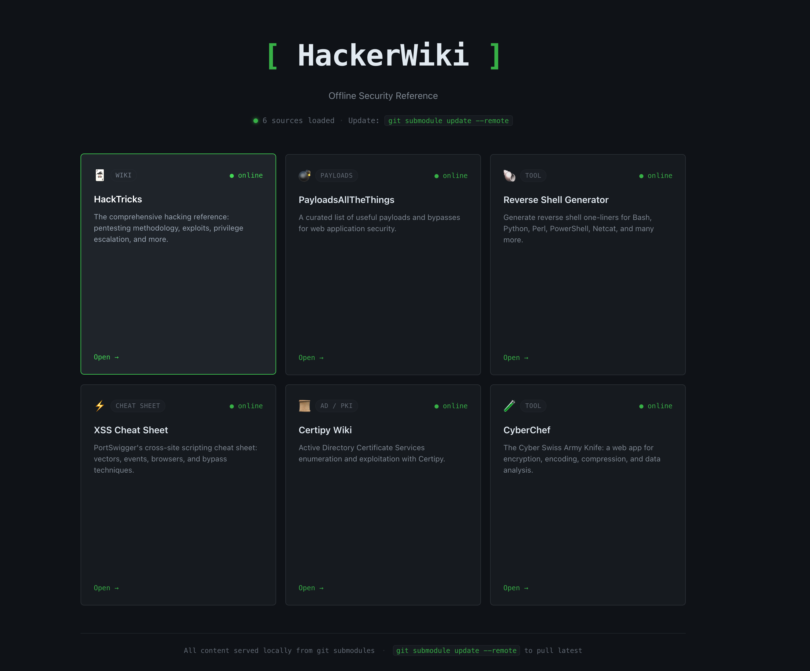

# HackerWiki

A Go server that mirrors a handful of security reference sites/tools locally, each mounted under its own path (HackTricks, PayloadsAllTheThings, Revshells, PortSwigger's XSS cheat sheet, Certipy's wiki, CyberChef, GTFOBins, LOLBAS). Provides a landing page so you can navigate between them all, and use each in offline environments. Also does not rely on running multiple containers, its just an executable.



## First-time setup

Prebuilt binaries for Linux, macOS, and Windows (amd64 + arm64) are already committed under `dist/` — no Go toolchain or build step needed.

```
git clone --recurse-submodules git@github.com:RichHacks/OfflineHackerWiki.git
cd OfflineHackerWiki
./dist/hackerwiki-windows.exe
```

Open http://localhost:8888. Custom port: `./dist/hackerwiki-darwin-arm64 -port 9000`.

If you ever end up with an empty `content/<name>` directory (e.g. after a plain `git clone` without `--recurse-submodules`):

```
git submodule update --init --recursive
```

